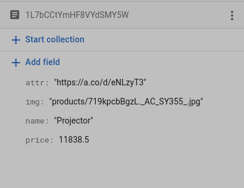

# Capstone Project

This is an E-Commerce Website hosted on Firebase. The assets for the project are stored in Firebase Database and Storage. Images stored alongside the code ([src/assets](src/assets) folder) are used for initial rendering of the website and cannot be stored anywhere lest the page layout be broken.

## Installation

First [clone](https://docs.github.com/en/repositories/creating-and-managing-repositories/cloning-a-repository) the project to your local development. You can use `git` to clone the repo. For Linux, MacOS and most *nix OS'es have it installed by default. If on Windows or not installed you can download the repo as a zip file or install on windows [git for windows](https://gitforwindows.org/) or [other os'es](https://git-scm.com/).

```bash
git clone https://github.com/gekkowrld/capstone # To clone the repo
cd capstone # To head over to the repo
npm install # Install the required dependencies
npm start # To start the project locally
```

When running `npm` make sure you are running it on recognized `sh` variant. I recommend `bash` for its universal use. If on platforms that use unsupported `sh` variants, consider running `bash` command. In most platforms it is installed by default. On windows `powershell` is a pretty good shell to run npm on. You can refer to documentation on supported shells. For `fish` users refer to this <https://github.com/fish-shell/fish-shell/issues/3023>

Make sure you have the credentials as provided by [firebase sdk](https://firebase.google.com/docs/web/setup) for authentication. The information should be stored in a [`.env` file](https://medium.com/how-to-react/using-env-file-in-react-js-b2714235e77e) file at the root of the directory(or project).

The following data should be provided:

```env
REACT_APP_FIREBASE_API_KEY = "XXXXXXXXXXXXXXXXXXXXXXXXXXXXXXXX"
REACT_APP_AUTH_ADMIN = "XXXXXXXXXXXXXXXXXXXXXXXXXX"
REACT_APP_DATABASE_URL = "XXXXXXXXXXXXXXXXXXXXXXXXXXXXXXXX"
REACT_APP_PROJECT_ID = "XXXXXXXXXXXXXXXXXX"
REACT_APP_STORAGE_BUCKET = "XXXXXXXXXXXXXXXXXXXX"
REACT_APP_MESSAGING_SENDER_ID = "XXXXXXXXXXXXXX"
REACT_APP_APP_ID = "XXXXXXXXXXXXXXXXXXXXXXXXXXXXXXXXXXX"
REACT_APP_MEASUREMENT_ID = "X-XXXXXXXXX"
```

> Make sure to replace the `X' with the correct info.

## Firebase setup

After [registering your app](https://firebase.google.com/docs/web/setup) you need to a `collection` known as `products`. This will contain the products the you will display.

The products should contain the following compulsory data:

```txt
name: "The name of the product"
img: "Location_of_the_image_as_saved_in_firebase_storage"
price: price_of_item
```

An example of the data entered:



The image should be stored in firebase storage. The image should be stored in the specified location as in the `img` field of the product.


You can add other info as per your wish.

In firebase storage, add the media that you will use in the site.

## Disclaimer

This project uses images, multimedia, info and other resources from the internet. I do not own any of the resources used in this project. This project is for educational purposes only.

A special mention goes to [`Amazon`](https://amazon.com) for providing most (if not all) the e commerce info and layout design and [`picsum`](htpps://picsum.photos) for providing the images used as profile picture placeholder.

This project is released under the [UNLICENSE License](UNLICENSE). Please see the `UNLICENSE` file for more information. If the license is not suitable for your use case, you can use the resources used in this project according to the license of the respective resource. The logo(s) of the project is also released under the same license.

I have tried to include the attributes of the resources used in this project in the respective file of each project. If you find any resource that is not properly attributed, please let me know and I will update the `README.md` and or file(s) of the project.

I'm using the free tier of Firebase. So, the project may not work if the free tier is exhausted. If you find any issues, please let me know and I will try to fix it as soon as possible. You can [open a new issue](https://github.com/gekkowrld/capstone/issues/new)

:warning: **Don't use this repo (or the code inside) in production (or anywhere that security is of utmost importance) as it has security issues. This issues are due to some dependencies that react depends on and cannot be easily updated because of [dependency hell](https://blog.tidelift.com/dependency-hell) and other issues. This dependency security issues range from moderate to high. Please look at the dependencies and try and resolve the issues**
